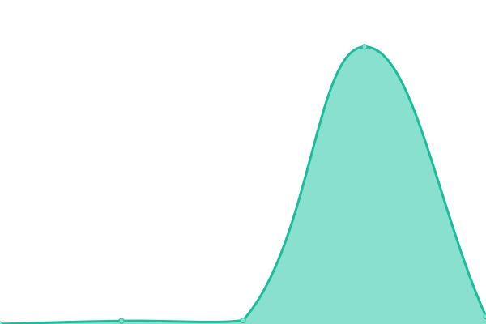
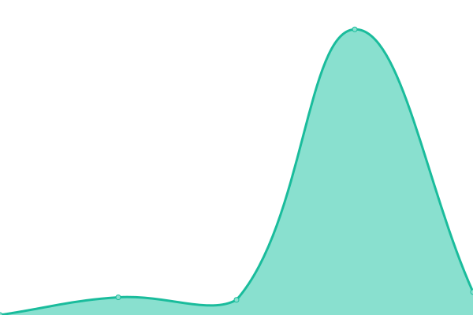

# [📈 Live Status](https://integratedmodelling.github.io/upptime): <!--live status--> **🟧 Partial outage**

This repository contains the open-source uptime monitor and status page for [Integrated Modelling Partnership](https://integratedmodelling.org), powered by [Upptime](https://github.com/upptime/upptime).

With [Upptime](https://upptime.js.org), you can get your own unlimited and free uptime monitor and status page, powered entirely by a GitHub repository. We use [Issues](https://github.com/integratedmodelling/upptime/issues) as incident reports, [Actions](https://github.com/integratedmodelling/upptime/actions) as uptime monitors, and [Pages](https://integratedmodelling.github.io/upptime) for the status page.

<!--start: status pages-->
<!-- This summary is generated by Upptime (https://github.com/upptime/upptime) -->
<!-- Do not edit this manually, your changes will be overwritten -->
<!-- prettier-ignore -->
| URL | Status | History | Response Time | Uptime |
| --- | ------ | ------- | ------------- | ------ |
|  [Hub](https://integratedmodelling.org/hub/) | 🟩 Up | [hub.yml](https://github.com/integratedmodelling/upptime/commits/HEAD/history/hub.yml) | 

 544ms
     
 | 

<a href="https://integratedmodelling.github.io/upptime/history/hub">100.00%</a>
    

|  [k.Explorer](https://integratedmodelling.org/modeler/) | 🟩 Up | [k-explorer.yml](https://github.com/integratedmodelling/upptime/commits/HEAD/history/k-explorer.yml) | 

 2699ms
     
 | 

<a href="https://integratedmodelling.github.io/upptime/history/k-explorer">100.00%</a>
    

|  [Data](https://data.integratedmodelling.org/) | 🟩 Up | [data.yml](https://github.com/integratedmodelling/upptime/commits/HEAD/history/data.yml) | 

 722ms
     
 | 

<a href="https://integratedmodelling.github.io/upptime/history/data">100.00%</a>
    

|  [PeopleEA](https://peopleea.integratedmodelling.org/modeler/) | 🟩 Up | [people-ea.yml](https://github.com/integratedmodelling/upptime/commits/HEAD/history/people-ea.yml) | 

 2045ms
     
 | 

<a href="https://integratedmodelling.github.io/upptime/history/people-ea">98.09%</a>
    

|  [Observ](https://observ.integratedmodelling.org/modeler) | 🟥 Down | [observ.yml](https://github.com/integratedmodelling/upptime/commits/HEAD/history/observ.yml) | 

 736ms
     
 | 

<a href="https://integratedmodelling.github.io/upptime/history/observ">10.50%</a>
    

<!--end: status pages-->

[**Visit our status website →**](https://integratedmodelling.github.io/upptime)

## 📄 License

- Powered by: [Upptime](https://github.com/upptime/upptime)
- Code: [MIT](./LICENSE) © [Anand Chowdhary](https://anandchowdhary.com), supported by [Pabio](https://pabio.com)
- Data in the `./history` directory: [Open Database License](https://opendatacommons.org/licenses/odbl/1-0/)
