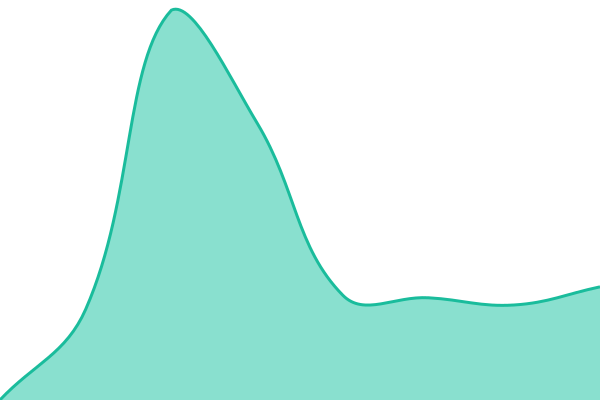
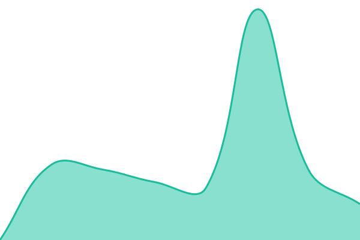
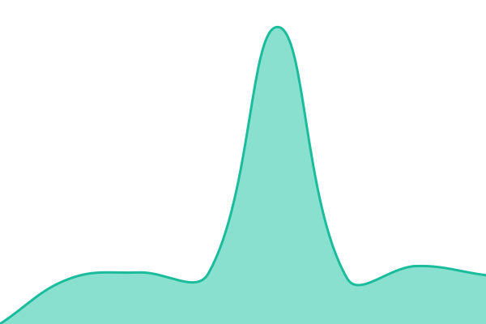
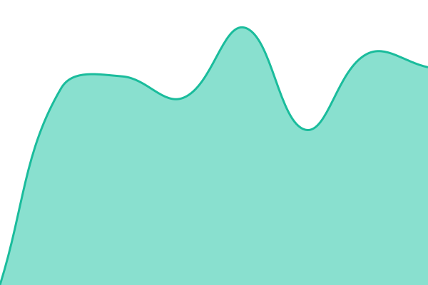
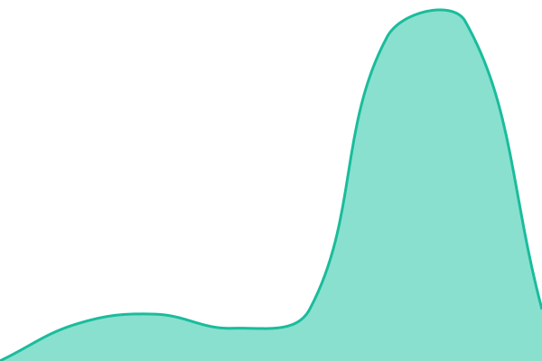
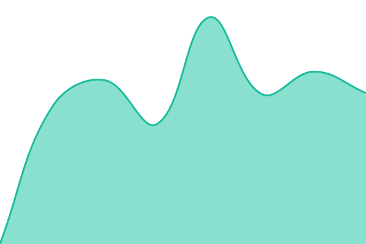
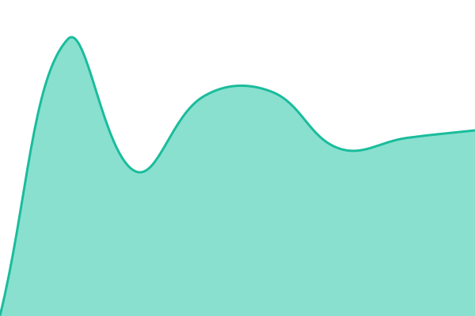
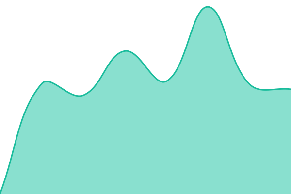
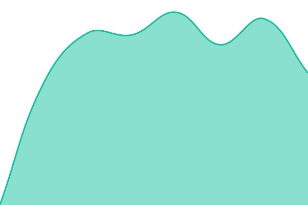

# [📈 Live Status](https://integratedmodelling.github.io/upptime): <!--live status--> **🟧 Partial outage**

This repository contains the open-source uptime monitor and status page for [Integrated Modelling Partnership](https://integratedmodelling.org), powered by [Upptime](https://github.com/upptime/upptime).

With [Upptime](https://upptime.js.org), you can get your own unlimited and free uptime monitor and status page, powered entirely by a GitHub repository. We use [Issues](https://github.com/integratedmodelling/upptime/issues) as incident reports, [Actions](https://github.com/integratedmodelling/upptime/actions) as uptime monitors, and [Pages](https://integratedmodelling.github.io/upptime) for the status page.

<!--start: status pages-->
<!-- This summary is generated by Upptime (https://github.com/upptime/upptime) -->
<!-- Do not edit this manually, your changes will be overwritten -->
<!-- prettier-ignore -->
| URL | Status | History | Response Time | Uptime |
| --- | ------ | ------- | ------------- | ------ |
|  [Hub](https://integratedmodelling.org/hub/) | 🟩 Up | [hub.yml](https://github.com/integratedmodelling/upptime/commits/HEAD/history/hub.yml) | 

 1858ms
     
 | 

<a href="https://status.integratedmodelling.org/history/hub">100.00%</a>
    

|  [Confluence](https://confluence.integratedmodelling.org/) | 🟩 Up | [confluence.yml](https://github.com/integratedmodelling/upptime/commits/HEAD/history/confluence.yml) | 

 1319ms
     
 | 

<a href="https://status.integratedmodelling.org/history/confluence">100.00%</a>
    

|  [Chat](https://chat.integratedmodelling.org/) | 🟩 Up | [chat.yml](https://github.com/integratedmodelling/upptime/commits/HEAD/history/chat.yml) | 

 1630ms
     
 | 

<a href="https://status.integratedmodelling.org/history/chat">100.00%</a>
    

|  [Web](https://klab.integratedmodelling.org/) | 🟩 Up | [web.yml](https://github.com/integratedmodelling/upptime/commits/HEAD/history/web.yml) | 

 2011ms
     
 | 

<a href="https://status.integratedmodelling.org/history/web">100.00%</a>
    

|  [Production Geoserver](https://integratedmodelling.org/geoserver/) | 🟩 Up | [production-geoserver.yml](https://github.com/integratedmodelling/upptime/commits/HEAD/history/production-geoserver.yml) | 

 1046ms
     
 | 

<a href="https://status.integratedmodelling.org/history/production-geoserver">100.00%</a>
    

|  [CKAN](https://data.integratedmodelling.org/) | 🟩 Up | [ckan.yml](https://github.com/integratedmodelling/upptime/commits/HEAD/history/ckan.yml) | 

 1184ms
     
 | 

<a href="https://status.integratedmodelling.org/history/ckan">83.55%</a>
    

|  [Caliper](https://caliper.integratedmodelling.org/caliper/browse/showvoc) | 🟩 Up | [caliper.yml](https://github.com/integratedmodelling/upptime/commits/HEAD/history/caliper.yml) | 

 1820ms
     
 | 

<a href="https://status.integratedmodelling.org/history/caliper">100.00%</a>
    

|  [ARIES for SEEA remote engine](https://klab.officialstatistics.org/modeler/) | 🟩 Up | [aries-for-seea-remote-engine.yml](https://github.com/integratedmodelling/upptime/commits/HEAD/history/aries-for-seea-remote-engine.yml) | 

 1609ms
     
 | 

<a href="https://status.integratedmodelling.org/history/aries-for-seea-remote-engine">100.00%</a>
    

|  [PeopleEA remote engine](https://peopleea.integratedmodelling.org/modeler/) | 🟩 Up | [people-ea-remote-engine.yml](https://github.com/integratedmodelling/upptime/commits/HEAD/history/people-ea-remote-engine.yml) | 

 1051ms
     
 | 

<a href="https://status.integratedmodelling.org/history/people-ea-remote-engine">100.00%</a>
    

|  [WEED remote engine](https://weed.integratedmodelling.org/modeler/) | 🟩 Up | [weed-remote-engine.yml](https://github.com/integratedmodelling/upptime/commits/HEAD/history/weed-remote-engine.yml) | 

 1530ms
     
 | 

<a href="https://status.integratedmodelling.org/history/weed-remote-engine">100.00%</a>
    

|  [NBSOIL remote engine](https://nbsoil.integratedmodelling.org/modeler/) | 🟩 Up | [nbsoil-remote-engine.yml](https://github.com/integratedmodelling/upptime/commits/HEAD/history/nbsoil-remote-engine.yml) | 

 490ms
     
 | 

<a href="https://status.integratedmodelling.org/history/nbsoil-remote-engine">100.00%</a>
    

|  [HeCo Invest remote engine](https://hecoinvest.integratedmodelling.org/modeler/) | 🟩 Up | [he-co-invest-remote-engine.yml](https://github.com/integratedmodelling/upptime/commits/HEAD/history/he-co-invest-remote-engine.yml) | 

 1036ms
     
 | 

<a href="https://status.integratedmodelling.org/history/he-co-invest-remote-engine">100.00%</a>
    

|  [Urdaibai app remote engine](https://euskadi.integratedmodelling.org/modeler/?app=urdaibai.en) | 🟩 Up | [urdaibai-app-remote-engine.yml](https://github.com/integratedmodelling/upptime/commits/HEAD/history/urdaibai-app-remote-engine.yml) | 

 561ms
     
 | 

<a href="https://status.integratedmodelling.org/history/urdaibai-app-remote-engine">100.00%</a>
    

|  [Mijares app remote engine](https://mijares.integratedmodelling.org/modeler/?app=urdaibai.en) | 🟩 Up | [mijares-app-remote-engine.yml](https://github.com/integratedmodelling/upptime/commits/HEAD/history/mijares-app-remote-engine.yml) | 

 513ms
     
 | 

<a href="https://status.integratedmodelling.org/history/mijares-app-remote-engine">100.00%</a>
    

|  [Observ app remote engine](https://observ.integratedmodelling.org/modeler/?app=urdaibai.en) | 🟥 Down | [observ-app-remote-engine.yml](https://github.com/integratedmodelling/upptime/commits/HEAD/history/observ-app-remote-engine.yml) | 

 503ms
     
 | 

<a href="https://status.integratedmodelling.org/history/observ-app-remote-engine">0.00%</a>
    

|  [Weather node](https://knowledge.integratedmodelling.org/weather/) | 🟩 Up | [weather-node.yml](https://github.com/integratedmodelling/upptime/commits/HEAD/history/weather-node.yml) | 

 492ms
     
 | 

<a href="https://status.integratedmodelling.org/history/weather-node">100.00%</a>
    

|  [Geo node](https://knowledge.integratedmodelling.org/geo/) | 🟩 Up | [geo-node.yml](https://github.com/integratedmodelling/upptime/commits/HEAD/history/geo-node.yml) | 

 471ms
     
 | 

<a href="https://status.integratedmodelling.org/history/geo-node">100.00%</a>
    

|  [Stats node](https://knowledge.integratedmodelling.org/stats/) | 🟩 Up | [stats-node.yml](https://github.com/integratedmodelling/upptime/commits/HEAD/history/stats-node.yml) | 

 519ms
     
 | 

<a href="https://status.integratedmodelling.org/history/stats-node">100.00%</a>
    

|  [Overpass](https://knowledge.integratedmodelling.org/overpass/api/status) | 🟩 Up | [overpass.yml](https://github.com/integratedmodelling/upptime/commits/HEAD/history/overpass.yml) | 

 541ms
     
 | 

<a href="https://status.integratedmodelling.org/history/overpass">100.00%</a>
    

<!--end: status pages-->

[**Visit our status website →**](https://integratedmodelling.github.io/upptime)

## 📄 License

- Powered by: [Upptime](https://github.com/upptime/upptime)
- Code: [MIT](./LICENSE) © [Anand Chowdhary](https://anandchowdhary.com), supported by [Pabio](https://pabio.com)
- Data in the `./history` directory: [Open Database License](https://opendatacommons.org/licenses/odbl/1-0/)
